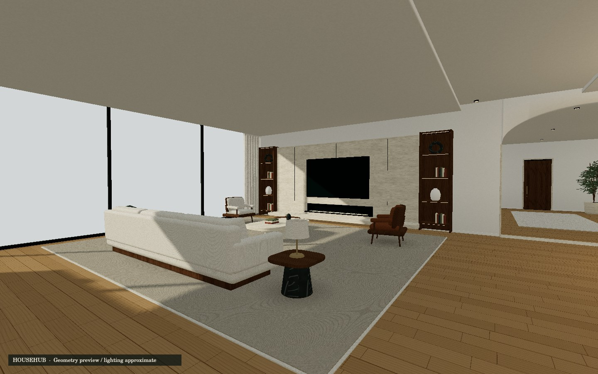
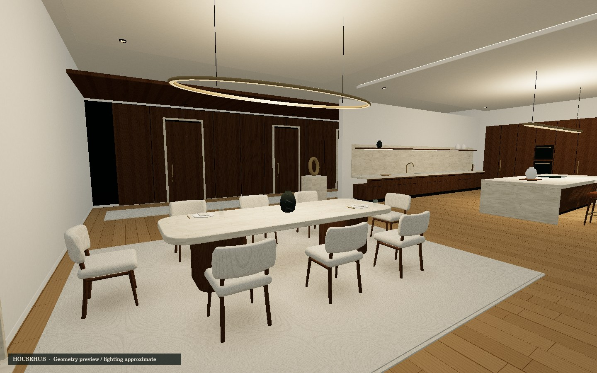

# Househub

A furnished luxury residence and future VR home hub in Three.js, built for
standalone Meta Quest 3. The environment occupies **28 × 22 metres (616 m²)**,
with **4.15 m main ceilings**. Furniture stays at human scale.

This revision replaces the original 18 × 14 m apartment. It includes a main
living room, separate window salon, eight-seat dining room, kitchen with a
four-seat island, primary bedroom and dressing area, double-vanity bathroom
with a walk-in shower, private entry gallery, and a dedicated four-door hub gallery.
Outside is a simple sky; connected destinations are for a later pass.

## Open it

**[Open Househub](https://permabulk69420-pixel.github.io/Househub/)**

Open the page in Meta Quest Browser and choose **Enter VR**.

| Device | Controls |
| --- | --- |
| Quest | Left thumbstick: walk; right thumbstick: turn |
| Quest | Hold either trigger to aim a teleport; release to move to a valid landing |
| Desktop | Drag to look; WASD or arrow keys to walk |
| Desktop | Explore locks the mouse; Escape releases it; Shift walks faster |
| Phone | Drag the room to look; use the left pad to walk |

The controls menu offers smooth or 30° snap turning, two walking speeds, and
return to the initial living-room view. Smooth turning is the default. Virtual
movement collides with walls and furniture; teleporting validates both the landing
and the intervening partitions. Physical room-scale movement remains headset-tracked.

## Environment and furniture

Chairs have continuous rear supports, shaped seats, solid curved backrests, and
closed walnut shells. Furniture is assembled in local coordinate frames, so
reclining a cushion and then turning the chair does not skew its back. The sofa
has a continuous supported back, a full chaise cushion, piping, and a draped throw.
The bed has separate upholstery, bedding, feet, a headboard, and bedside joinery.

Rounded stone countertops use independent corner and edge radii. Kitchen sinks
and the fireplace are real recesses. The bathtub has a continuous inner and outer
shell; curtains have folds and front/rear faces. Cabinet reveals, timber flutes,
light fittings, shelves, tableware, art, books, and individually modelled foliage
supply detail at room and hand scale.

## Materials and future texture work

The scene includes deterministic, locally generated oak, walnut, travertine,
plaster, fabric, rug, leather, and dark stone maps, plus metal, glass, mirror, and
ceramic PBR materials. There are no runtime CDN requests.

Place replacement maps in **`public/assets/materials/`** and update its
**`manifest.json`**. The folder's [texture guide](public/assets/materials/README.md)
shows the format. Base color, normal, roughness, metalness, and AO are supported.

UV0 measures metres; the manifest supplies each texture's physical tile size.
Planar projections are assigned in each piece's local frame before placement, so
wood grain follows the furniture's orientation. Curved backrests and draped cloth
have their own parametric UVs. Normals, UV0, and UV1 are retained on every mesh.
**UV1 is a placeholder, not a uniquely unwrapped lightmap atlas.** Tileable AO
uses UV0; a future baked-lighting pass must supply a separate atlas.

| Source | Purpose |
| --- | --- |
| `src/environment.js` | Floor plan, architecture, room arrangements, views, portal anchors |
| `src/furniture.js` | Reusable chairs, sofa, bed, lighting, joinery, plants and objects |
| `src/geometry.js` | Shaped upholstery, solid curved backs, cloth, arches and stone slabs |
| `src/builder.js` | Local transforms, metric UVs, collision bounds and static batching |
| `src/materials.js` | Shared material slots, fallback textures and PBR overrides |
| `src/apartment.js` | Public scene API, contact shadows and walkable-area queries |
| `src/navigation.js` | Desktop, touch and WebXR movement |

Static pieces are batched by room, material and shadow settings. Each batch
retains its authored part names in `userData.parts` for inspection. Bedroom and
bathroom materials use local reflection probes after material overrides are loaded.

## Rendering and validation

The full scene currently contains **1,048,596 triangles**, **121 static material
batches**, and **2,721 authored pieces**, before contact decals and controller
visuals. Indexed geometry occupies approximately **44 MB** of GPU attribute/index
buffers. These are whole-scene totals, not the triangles visible in a particular view.

- One cached 2048² directional shadow map and four shadowless practical lights.
- Static vertex shading and soft contact decals ground the furniture.
- Three reflection probes capture the public rooms, bedroom and bathroom once.
  The vanity mirrors use the bathroom probe; reflections are approximate and
  do not reflect the player or moving objects like a live planar mirror would.
- No bloom, screen-space AO, per-frame reflection captures or physics engine.
- Desktop pixel ratio is capped at 2; XR uses framebuffer scale 1 and foveation .45.

These choices preserve geometry quality while controlling rendering cost.
**Quest frame rate, thermal behaviour, controller input and final WebGL shader
appearance have not been measured on a headset in this development session.**
The scene's larger geometry budget is not a measured performance guarantee.
If a future feature moves a shadow caster or changes the sun, refresh the shadow
map; refresh the relevant reflection probe when the environment changes.

`npm run check` builds the real scene and verifies attributes, finite unit normals,
indexed buffers, collision openings, and reachability across the complete floor.
It reaches every room, the dressing area, shower, WC and all four future hub doors.
It also checks that furniture rotation preserves its vertical shape and local UVs,
that the sofa and bed reach the floor, and that XR turns preserve an off-centre
tracked head position. Geometry ceilings in the check catch accidental growth;
they are not a substitute for headset profiling.

The images in [docs/previews](docs/previews) were inspected individually and by
room, including the front and rear of chairs. They show the actual authored meshes
and procedural textures with **approximate offline lighting**. They are not browser
or headset screenshots: the development browser did not provide a WebGL context.




## VR origin and future hub doors

One world unit equals one metre; +Y is up and the floor is Y=0. The player uses a
`local-floor` reference space and the headset's measured height. The desktop eye
height is removed on entering VR, preventing a doubled height offset. Turning
pivots around the tracked head even when standing away from the tracking origin.

| Anchor | Position `[x, y, z]` | Purpose |
| --- | --- | --- |
| `PlayerSpawn` | `[-7.5, 0, -1.05]` | Initial living-room view |
| `HubDoor_01` | `[-11.5, 0, 10.72]` | Gallery bay 1 |
| `HubDoor_02` | `[-7.9, 0, 10.72]` | Gallery bay 2 |
| `HubDoor_03` | `[-4.3, 0, 10.72]` | Gallery bay 3 |
| `HubDoor_04` | `[0, 0, 10.72]` | Gallery bay 4 |
| `HubDoor_Entry` | `[0, 0, 10.72]` | Retained alias for bay 4 |
| `HubDoor_Hall` | `[13.72, 0, 1]` | Private gallery entrance |

The four gallery anchors have yaw π. The private entrance has yaw π/2. Doors are
closed environmental pieces with clear approach space; cross-repo routing and
room transitions are not implemented yet.

## Development and deployment

```sh
npm ci
npm run dev
npm run check
npm run build
```

The Actions workflow builds and publishes `dist/` on pushes to `main`. Keep Pages
configured to deploy from **GitHub Actions**. Relative build URLs support the
repository subpath. Three.js and Vite versions are pinned in the lockfile.

Inspection URLs: `?stats=1`, or `?view=living`, `?view=kitchen`, `?view=dining`,
`?view=reading`, `?view=bedroom`, `?view=dressing`, `?view=bathroom`, `?view=vanity`,
`?view=gallery`. Add `&clean=1` for an unobstructed view.
